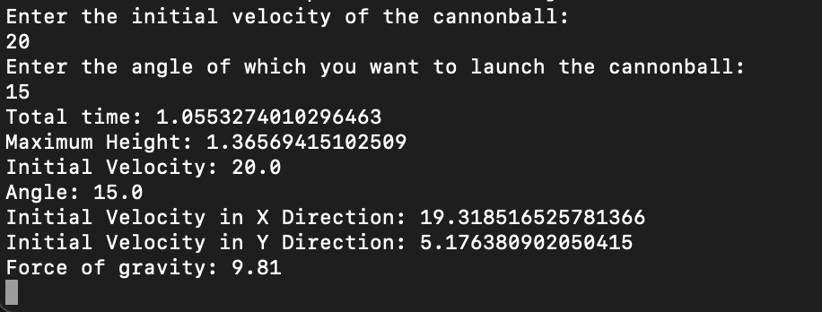
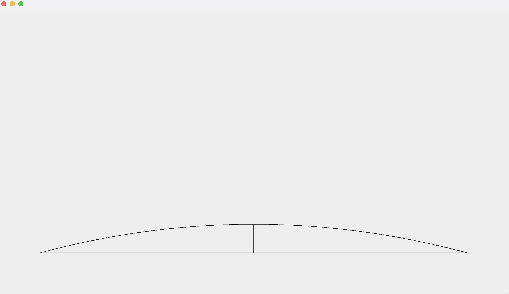

___

## Chapter 8 Project
### Cannonball Trajectory is an app that allows the user to enter values and see the trajectory of a cannonball shot. This app can be used by students to help visualize projectile motion and calculate the missing values associated with the problem.  

___
___

## Code

[Click here to view code](src)

[Click here to download jar](https://github.com/ethanbowles03/2020-2021Prg2Port/blob/main/Cannon/src/Cannonball.jar?raw=true)(**In Terminal** java -jar Cannonball.jar)

___

## Screen Captures

### Final Product
 
Terminal

Shot 1 @ 25 degrees

Shot 1 @ 80 degrees

