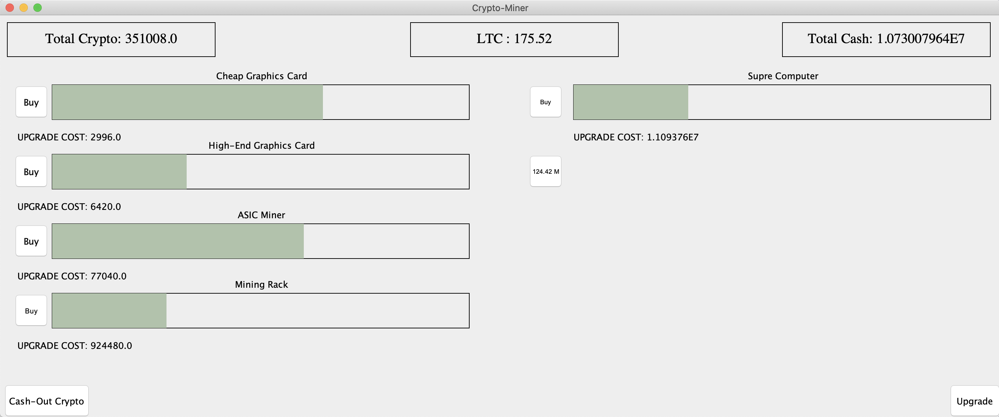

___

## 2020 AP Computer Programming Project
### Crypto Miner is an idle game where you mine the cryptocurrency with many different kinds of crypto-currency miners which mine at different rates and speeds. As you progress in the game you unlock better miners along with more valuable crypto-currencies. The player mines coins which they can trade for cash to buy objects such as cars and houses. Furthermore, this game is directly linked with the stock market value for eh currency, meaning it is more beneficial to sell the currency on some days rather than others.  

___
___

## Code

[Click here to view code](https://github.com/ethanbowles03/2020CP2Project/blob/main/src/)

___

## Timeline/Progress

#### 1.1 - Create Main Method and Frame
#### 1.2 - Learn How to Use Animations and Implement 
#### 1.3 - Create Multiple Animations and Make Total Labels
#### 1.4 - Create Bar Class
#### 1.5 - Make Button Class
#### 1.6 - Make Buttons Show Their Cost and The Next Button Available
#### 1.7 - Make Upgrade Label
#### 1.8 - Get Button ActionListner Working
#### 1.9 - Make Bars Different Values and Speeds
#### 1.10 - Create Crypto Label
#### 1.11 - Create Stock Puller With URL Class
#### 1.12 - Make Upgrade Button To Change Between Multiple CryptoCurrencies
#### 1.13 - Create Cash Label
#### 1.14 - Make Upgrade Buttons Work
#### 1.15 - Create Cash Exchange Button
#### 1.16 - Implement Cash Exchange
#### 1.17 - Debug

___

## Class Diagram

___

## User Interface

___

## Screen Captures

#### Final Product

