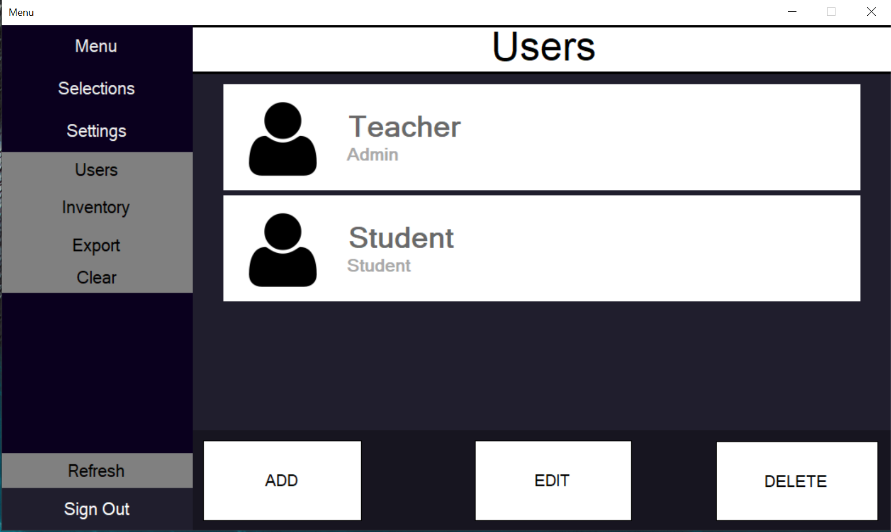

___

## 2020 - 2021 TSA State and Nationals
### Learning Menu is an application I developed in C# to compete in my State TSA Software Development competition. It is an application to be used by teachers and students in classrooms. It allows teachers to create courses or assignments for students to select themselves. This gives students and teachers more freedom in creating and choosing their assignments. Students can create selections of courses/assignments. Furthermore, students and teachers have different accounts allowing different access to certain people. For example, students aren't allowed to make courses and edit accounts.  

___
___

## Code

[Click here to view code](https://github.com/ethanbowles03/2020CP2Project/blob/main/LearningMenu/src/code)

[Click here to download jar](https://github.com/ethanbowles03/2020-2021Prg2Port/blob/main/LearningMenu/src/MenuProgramEB.zip?raw=true)(bins -> debug -> .exe)

___

## Documentation and Design

<a href="https://github.com/ethanbowles03/2020-2021Prg2Port/blob/main/LearningMenu/CONTENTS/SchoolCoursePortfolioTSADocument.pdf?raw=true" target="_blank">View documents</a>

___

## YouTube

[Video](https://www.youtube.com/watch?v=fdd6oXHhgl8&t=189s)

___

## Screen Captures

### Final Product
 
Login Screen

Teacher Menu

Student Menu

Selections Screen

Users Screen

