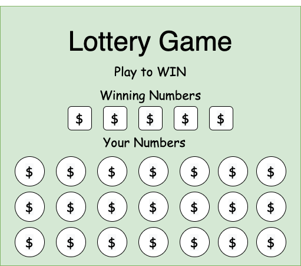
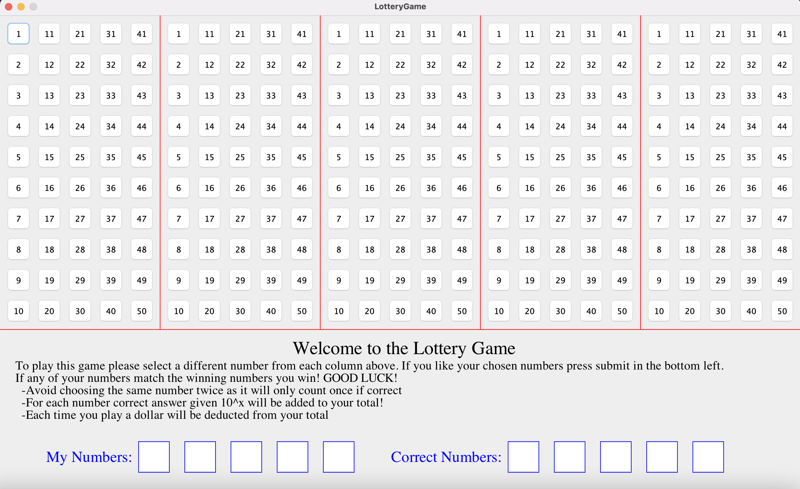

  

___

## Chapter 2 Project
### The Lottery Game is a game I designed using Java Swing. It was one of the first major projects I did that year. The player will select 5 number buttons from an assortment of 125 buttons (1 from each row). The user's buttons are then compared to 5 randomly selected buttons generated by the computer. If any of the user selections are the same as the buttons below, the player will win a sum of money. The more numbers correct, the more money the player wins. Each time the user plays, the user spends money to buy the ticket. The goal of the game/simulation is to win as much money as possible.

___
___

## Code

[Click here to view code](src)

[Click here to download jar](https://github.com/ethanbowles03/2020-2021Prg2Port/blob/main/LotteryGame/src/LotteryGame.jar?raw=true)

[Please also download the save file(GameTotal.txt) and put it in the same folder as the jar](src)

___

## Screen Captures

### Final Product
 

