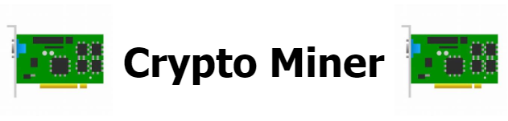
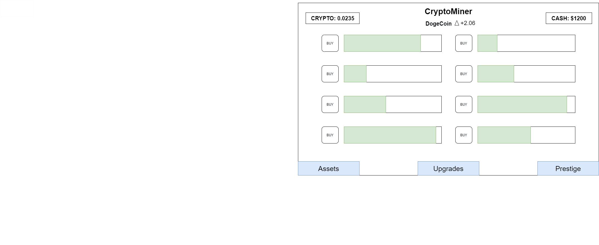

___

## 2020 AP Computer Programming Project
### Crypto Miner is an idle game where you mine the cryptocurrency with many different kinds of crypto-currency miners which mine at different rates and speeds. As you progress in the game you unlock better miners along with more valuable crypto-currencies. The player mines coins which they can trade for cash to buy objects such as cars and houses. Furthermore, this game is directly linked with the stock market value for eh currency, meaning it is more beneficial to sell the currency on some days rather than others.  

___
___

## Code

[Click here to view code](https://github.com/ethanbowles03/2020CP2Project/blob/main/src/)

___

## Class Diagram

___

## User Interface

___

## Screen Captures

