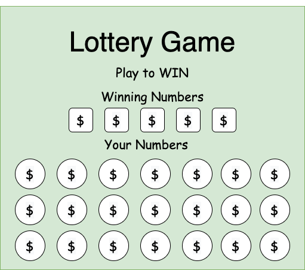

<h1 align="center">Programming 2 Portfolio || 2020 - 2021</h1>
<h2 align="center">By Ethan Bowles</h2>

___
___
<h2 align="center">Launchpad</h2>

#### Launchpad is a simulation of a music sound pad that DJs and producers use. My group and I created this app using Java Swing, implementing many features from JButtons to ArrayLists to store looping audios. It is fully functional with up to 25 .WAV files which the user can select and also includes loop and stop buttons to create some amazing mixes. The user is also allowed to import their sounds into the "soundFiles" file. 

  

[Link to Launchpad](Launchpad)

___
<h2 align="center">Crypto-Miner</h2>

#### Crypto-Miner is an idle game that simulates mining crypto-currency. The game was inspired by games like Adventure Capitalist and other idle games. As a user, you will buy better and faster mining machines to mine more crypto-currencies. The game tracks the actual prices of crypto-currencies adding a further challenge to the user on when to sell. The goal of the user is to make as much money as possible. 

  

[Link to Crypto-Miner](CryptoMiner)

___
<h2 align="center">Learning Menu</h2>

#### * Placed 1st in State of Utah TSA Software Development Competition*
#### Learning Menu is an application I developed in C# to compete in my State TSA Software Development competition. It is an application to be used by teachers and students in classrooms. It allows teachers to create courses or assignments for students to select themselves. This gives students and teachers more freedom in creating and choosing their assignments. Students can create selections of courses/assignments. Furthermore, students and teachers have different accounts allowing different access to certain people. For example, students aren't allowed to make courses and edit accounts. 

  

[Link to Learning Menu](LearningMenu)

___
<h2 align="center">Cannonball Trajectory</h2>

#### Cannonball Trajectory is an app that allows the user to enter values and see the trajectory of a cannonball shot. This app can be used by students to help visualize projectile motion and calculate the missing values associated with the problem.

  

[Link to Cannonball Trajectory](Cannon)

___
<h2 align="center">Lottery Game</h2>

#### The Lottery Game is a game I designed using Java Swing. It was one of the first major projects I did that year. The player will select 5 number buttons from an assortment of 125 buttons (1 from each row). The user's buttons are then compared to 5 randomly selected buttons generated by the computer. If any of the user selections are the same as the buttons below, the player will win a sum of money. The more numbers correct, the more money the player wins. Each time the user plays, the user spends money to buy the ticket. The goal of the game/simulation is to win as much money as possible.

  

[Link to Lottery Game](LotteryGame)

___
#### Please feel free to look at all of my chapter projects and assignments with the 2 links below
[Link to Chapters](ChapterProjects?raw=true)

[Link to Assignments](Classwork?raw=true)

___
___

<h1 align="center">Programming 1 Portfolio || 2018 - 2019</h1>
<h2 align="center">By Ethan Bowles</h2>

___
___

## Processing
### -ScreenSaverApp-
#### --Completed Oct. 30 2019--
My screen saver app creates a full screen screen saver that generates random lines that connect.

It has a white background and randomly generates lines that connect in shades of grey and black

[Click here to view code](Screen/screenSaverApp.zip)

### -CalculatorApp-
##### --Completed Nov. 20 2019--
My calculator is an object oriented program with most of the basic function on most calculators.

The calculator has a grey and black theme along with a screen which prints numbers as you click them.

[Click here to view code](Calc/calculatorApp.zip)

### -SpaceShipGame-
#### --Completed Jan. 10--
My space ship game is an object oriented program that uses a ship, rocks and lasers to compose a game.

You fly a F-18 through space and try to hit every asteroid, as they pass, with lasers.

If they pass or hit you, you take damage. If your health reaches 0, you lose.

[Click here to view code](SpaceGame/spaceShipGame.zip)

### -ItsADate-
#### --Completed Fri. Feb 8--
The 'ItsADate' app was one of the first programs i created in C++.

You input your birthday and it prints information about how long you have lived such as days, months and years.

[Click here to view code](ItsADate/date.cpp)

### -WordCreator-
#### --Completed Mar.12 2019--
My 'WordCreator' app is a random word generator.

It generates a random prexif, suffix, and root word, and creats a new word.

It also provides the defenintion for the new word using the defenitions from the prefix, suffix and root word.

 [Click here to view code](WordCreator/Word%20Creator%20Group%201)

### -ShrekAdventureGame-
#### -- Completed Mar. 4 2019--

The 'ShrekAdventureGame' is a story game.

It is very similar to the game 'Lifeline' on ios.

It goes through the basic plot of the movie. To move on to the next scene, you need to answer a set of math related questions.

It was the first program I created in C++ which has classes.

[Click here to view code](ShrekAdveture/Shrek%20Adventure)
